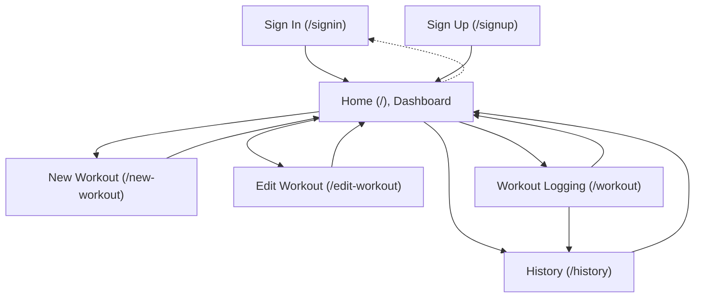

# Web Application Views and Features Overview

This document provides an overview and analysis of all main views (pages/screens) and core features available in the Ares Workout Tracker web app. The information is derived directly from the application's route definitions, template files, and associated logic, accurately describing the application's structure and user experience.

---

## Application Structure

Ares is structured as a Flask web application organized with blueprints for route separation and modularity. Most business logic and view routing for workout management are defined in `website/views.py`, while authentication logic resides in `website/auth.py`. The app uses Jinja2 templates stored in `website/templates/`, enabling dynamic content rendering and a modern, responsive UI.

### Navigation

The application features a persistent navbar (when users are authenticated) that includes direct links to the main functional screens:
- Home (`/`)
- Workout (`/workout`)
- History (`/history`)
- New Workout (`/new-workout`)
- Edit Workout (`/edit-workout`, accessible through the dashboard)
- Logout (`/logout`)

---

## Views (Pages/Screens)

Below is a summary of each main view/page provided by the app:

### 1. **Sign In (`/signin`)**
- **Template:** `signin.html`
- **Features:** 
  - User authentication/login form.
  - Option to sign in as a demo user (creates a new, temporary account).
  - Form fields for email and password with validation and error/success messages.
  - Link to sign up for a new account.
- **Purpose:** Allows users to sign in to their accounts or try out the app via a demo user.

### 2. **Sign Up (`/signup`)**
- **Template:** `signup.html`
- **Features:**
  - User registration form with input validation for email, password, and password confirmation.
  - Feedback for existing accounts and incorrect details.
- **Purpose:** Enables new users to create an account and begin using the app.

### 3. **Home (`/`)**
- **Template:** `home.html`
- **Features:**
  - Modern dashboard summarizing user's workouts and total exercises.
  - Feature highlight section (track progress, set goals, stay motivated).
  - Quick actions for starting a workout, creating a new workout, and viewing progress.
  - For first-time/new users: an invitation to create the first workout.
  - For users with workouts: a showcase of all existing workout routines, with options to edit or duplicate.
- **Purpose:** Serves as a dashboard landing page post-login, orienting the user for navigation and giving quick access to common actions.

### 4. **Workout (`/workout`)**
- **Template:** `workout.html`
- **Features:**
  - Allows users to select and view details for any of their workouts via a dropdown selector.
  - Displays all exercises for the selected workout, with an interactive interface to log weights, reps, and (where configured) exercise details.
  - Provides real-time progress tracking and completion status for each exercise.
  - Includes "Quick Log", manual "Save" action, and "Notes" for each exercise.
  - Embedded workout timer modal to aid in training sessions.
  - Progress bars and statistics to show workout completion.
  - Responsive design with enhanced feedback, e.g., animations and notifications.
  - Handles AJAX saving of exercise data for seamless UX.
- **Purpose:** Central hub for logging workout progress and managing ongoing training sessions.

### 5. **Workout History (`/history`)**
- **Template:** `history.html`
- **Features:**
  - Visualizes summaries and details of all completed workout sessions.
  - Filter and sort workout history by workout type, date range, and other metrics.
  - Grid/list views for historical sessions.
  - Each session displays exercises, weights, reps, and additional details such as machine settings.
  - Statistical summaries: total sessions, unique workouts, total exercises.
  - Export and refresh options, plus an empty state prompt for new users.
- **Purpose:** Lets users review their workout journey, track improvement, and analyze their activity history.

### 6. **New Workout (`/new-workout`)**
- **Template:** `new-workout.html`
- **Features:**
  - Guided form for creating a new workout routine.
  - Inputs for workout name, optional description, and categorization (choose existing or create new category).
  - Dynamic addition of exercises, option to enable additional tracking fields (weight, reps, sets) per exercise.
  - Client-side validation with AJAX-enhanced interactions for adding/removing exercises.
- **Purpose:** Allows users to custom-create structured workout routines according to personal fitness goals.

### 7. **Edit Workout (`/edit-workout`)**
- **Template:** `edit-workout.html`
- **Features:**
  - Interface to select and modify existing workouts.
  - Edit names, descriptions, category, and exercises (add, remove, reorder, retitle, or enable details).
  - Actions to save, cancel, duplicate, or delete workouts, all protected by confirmation dialogs.
  - Drag-and-drop support for reordering exercises.
- **Purpose:** Empowers users to refine, reorganize, or remove existing workout routines.

---

## Core Features Across the App

- **Authentication:** User sign-up, login, demo user creation, and logout.
- **Flashed Messages:** Inform users of validation errors, operation successes, or important events.
- **Modern, Responsive Design:** Consistent use of modern UI patterns, mobile support, and visual feedback.
- **AJAX Interactions:** Many save functions (workout/exercise completion, etc.) are handled asynchronously for instantaneous feedback.
- **Workout CRUD:** Users can create, read, update, duplicate, and delete workouts and associated exercises.
- **Progress Tracking:** Real-time stats, visual completion badges, and logs for each workout and session.
- **Filtering, Sorting, and Search:** Powerful tools for exploring a user's workout history.

---

## Summary Table of Main Views & Features

| View/Route         | Template         | Main Features                                   |
|--------------------|------------------|-------------------------------------------------|
| `/signin`          | signin.html      | Login, demo user, validation, account link      |
| `/signup`          | signup.html      | Registration, validation, onboarding            |
| `/` (Home)         | home.html        | Dashboard, stats, actions, collection list      |
| `/workout`         | workout.html     | Workout selection, exercise logging, timer      |
| `/history`         | history.html     | Session log, filters, analytics, export, search |
| `/new-workout`     | new-workout.html | Create workout, add exercises, categorization   |
| `/edit-workout`    | edit-workout.html| Edit, reorder, duplicate, or delete workouts    |

---

## Application Flow (Mermaid Diagram)

---

## Conclusion

The Ares Workout Tracker web app provides a modern, focused set of features that allows users to manage fitness routines, log exercise progress, and review workout history, all within an intuitive, responsive web interface. The application emphasizes speed and simplicity, offering powerful functionality such as real-time saving, rich history analytics, and flexible workout creation/editing, making it highly suitable for users seeking a streamlined fitness tracking experience.

