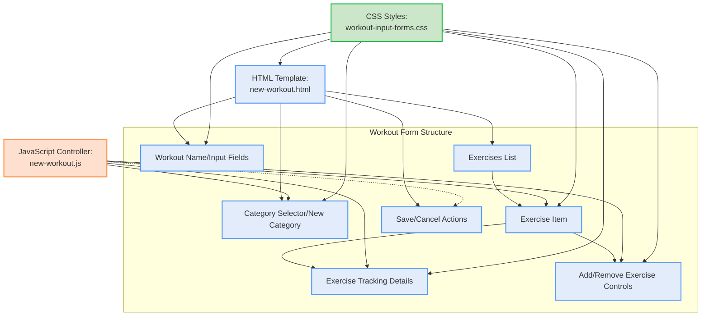

# Workout Page Input Form: Structure and Code Analysis

This document provides a thorough analysis of the existing code and structure for the workout input form used on the workout page. The aim is to understand its composition, logic, and styles as a foundation for future restyling or improvement.

---

## 1. High-Level Structure

The workout input form is primarily responsible for allowing users to:
- Enter a new workout's name and description.
- Select or create a workout category.
- Add, remove, and reorder exercises dynamically.
- Specify optional details for each exercise such as sets, reps, and weight.

**Main files and their roles:**
- **Template (HTML/Jinja2):**
  - `website/templates/new-workout.html`: The main HTML template for creating a workout.
- **JavaScript:**
  - `website/static/js/new-workout.js`: Provides dynamic behaviors for the form, including adding/removing exercises, toggling input states, managing UI feedback, and updating counters.
- **Styling:**
  - `website/static/css/workout-input-forms.css`: Defines the visual appearance of the workout input form and its components using CSS custom properties and modern design tokens.

---

## 2. Form Components and HTML Structure

### a. Workout Information Section

Located at the top of the form, this section gathers:
- **Workout Name**: Required, max 12 characters.
- **Description**: Optional, max 18 characters.
- **Category Selection**: Dropdown to choose an existing category.
- **Create New Category**: Optional inputs for a new category's name and description (conditional logic to toggle visibility).

### b. Exercises Section

This section is organized for users to manage exercises interactively:
- Each **exercise** is an HTML block rendered as:
    - An input for exercise name (required, max 45 characters).
    - Checkbox to include details (sets, reps, weight).
    - "Remove exercise" button.
    - Hidden template element (`#template`) is used for cloning new exercises via JS.
- Each exercise can contain additional fields for:
    - **Sets** (number, min 1, max 99)
    - **Reps** (text, max 20)
    - **Weight** (number, step 0.5, min 0, max 9999)
- Add exercise functionality via a "+ Add Exercise" button.

### c. Form Submission
- Save and cancel actions are provided at the bottom of the form.
- Action buttons: Save Workout (submit), Cancel (link back to home).

### d. Alerts and Feedback
- Uses "flash" messages for user feedback, shown via styled alert areas.

### e. JavaScript Inclusion
- The above template includes `/static/js/new-workout.js` for all logic.

---

## 3. JavaScript Logic

### Key Functions in `new-workout.js`:
- **Dynamic Exercise List Management**
    - Adding an exercise: Clones a hidden template, enables its fields, and inserts into the DOM.
    - Removing an exercise: Handles the animated removal and restricts users from removing all exercises (must keep at least one).
    - Updating exercise count: Keeps the count of exercise blocks up-to-date.
- **Tracking Details Toggle**
    - For each exercise, toggles the visibility and enabled state of tracking detail fields (sets, reps, weight) based on checkbox.
- **Category & New Category Logic**
    - When typing in a new category, resets the select; when choosing from select, resets new category fields; displays new category description field only when needed.
- **UI Animations & Enhancements**
    - Animates both adding/removing exercises and clicking form elements for user feedback.
    - Controls button visual feedback (scale/invert colors).
    - Handles dismissible alerts and runtime accessibility improvements.

---

## 4. Styling (CSS): `workout-input-forms.css`

This file delivers modern card-like visuals, focus effects, color gradients, animation, and accessibility details for the form:

#### Major style strategies:
- **Design Tokens:** Uses CSS variables for colors, radii, spacing, shadows, and transitions (enabling theme changes).
- **Responsive Design:** Media queries ensure mobile-friendly layouts and scaling.
- **Card/Group Classes:** Classes like `.exercise-card-modern`, `.input-group-modern`, and `.metric-group` style form containers and fields.
- **States**: Styles for hover, focus, success, error, and disabled states for interactive feedback.
- **Accessibility:** Focus ring and support for reduced motion and high contrast.
- **Animations:** Subtle entry/scale transitions, background gradients for focus, and animated status badges/units.
- **Component Hierarchy:**
    - `.exercise-card-modern`: Outer container for each exercise.
    - `.exercise-card-header`, `.exercise-card-body`, `.exercise-card-footer`: Logical subdivisions for header/fields/actions.
    - `.input-group-modern`, `.metric-input-field`: Enhanced styling for each input or input grouping.
    - `.status-badge`, `.previous-session-badge`: Visual indicators provided for extra user engagement (for further detail/logging features).

---

## 5. Organization and Relationships

The **template** (`new-workout.html`) provides both the visual and logical container, defining fields and the DOM structure.
- The **JavaScript** (`new-workout.js`) interacts with and manipulates DOM elements defined in the template. It uses class and ID selectors tightly coupled to the structure in the HTML.
- The **CSS** (`workout-input-forms.css`) provides foundational and modernized styles for the form, emphasizing card-based UIs, accessibility, and strong feedback semantics.

These components are interdependent:
- Inputs and buttons rely on CSS classes for their look/feel.
- JS logic expects certain DOM nodes and classes to exist (e.g., `.exercise-item`, `#add_exercise`).

---

## 6. Mermaid Component Structure Diagram

---

## 7. Summary of Key Elements to Consider for Restyling

- The form is already broken down into visually and functionally distinct sections.
- Card-based CSS classes suggest intention for modular, modern redesigns.
- JavaScript tightly manipulates and creates new DOM nodes, so class/ID changes must be reflected in both HTML and JS.
- Accessibility (labels with `for`, ARIA properties, focus management) is present but should be further evaluated in any redesign.
- Custom properties in CSS provide a good starting point for color, shadow, and radius changes for restyling.

---

## 8. References

**Code Files Used:**
- `website/templates/new-workout.html` (form and markup structure)
- `website/static/js/new-workout.js` (interactive dynamic logic)
- `website/static/css/workout-input-forms.css` (modernized UI styles)

---

This analysis provides the foundation for making informed decisions about where and how to implement style and UX changes for the workout input form. Any restyling should address the coordination between HTML structure, JavaScript selectors/event handlers, and CSS class usage.
